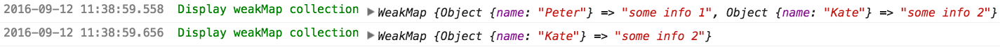
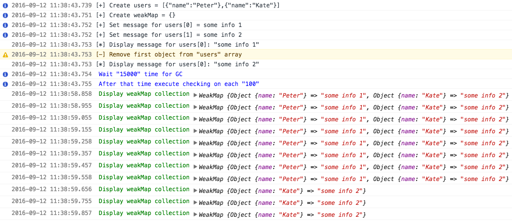
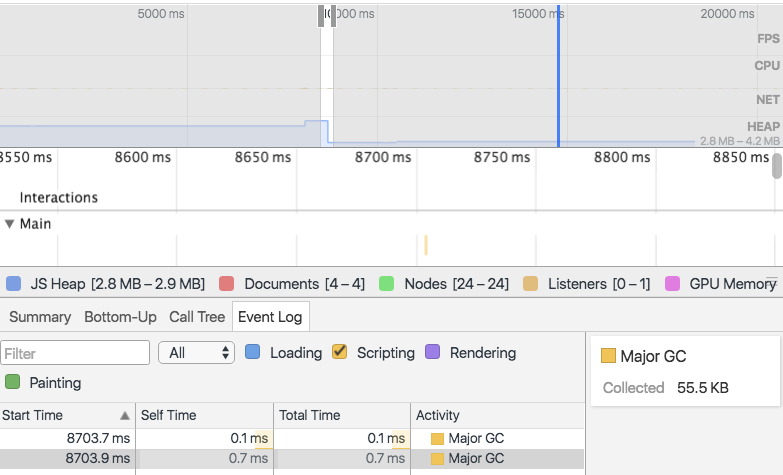

# test-es2015-weakmap

> :ledger: Testing WeakMap (reducing by Garbage Collector) from ECMAScript 2015 spec

## How it works?

1. Create `users` array with simple literal objects

    ```javascript
    var users = [{ name: 'Peter' }, { name: 'Kate' }];
    ```

2. Create `weakMap` object - instance of WeakMap constructor
    
    ```javascript
    var weakMap = new WeakMap();
    ```

3. Set two pairs where keys are objects from users

    ```javascript
    weakMap.set(users[0], 'some info 1');
    weakMap.set(users[1], 'some info 2');
    ```

4. Remove first element from `users` array
    
    ```javascript
    users.splice(0, 1);
    ```

5. Wait some time for Garbage Collector, which reduce `weakMap` collection



## Explanation

1. GC reduce WeakMap (DevTools Console)

    

2. GC was invoke (DevTools Timeline)

    

---

On above screenshot we can see that Garbage Collector was invoked couple seconds after idle time.
GC remove values from `WeakMap`. Proof is available on the first screenshot.

## License

[The MIT License](http://piecioshka.mit-license.org) @ 2016
